# REALITY WRAP 实际效果案例

以下为项目中实际生成并选定的 17 张最终版对比拼图，均为 **1080 × 1920（9:16）**，图片及文件名不标数字序号。横向原照片采用上下对比，竖向原照片采用左右完整对比及改造细节展示。仅选最终版，未混入手绘分身案例。

**摄影原图来源：[Pexels](https://www.pexels.com/)**（按项目作者提供的来源说明标注）。完整的来源与素材使用说明见 [THIRD_PARTY_NOTICES.md](../THIRD_PARTY_NOTICES.md)。

这些案例展示大尺度图形如何与不同摄影场景融合；每张图的母题、载体与保护范围随原图变化。生成细节仍需单独复核，不能把案例效果视作所有输入的保证。

## 秋湖泊舟

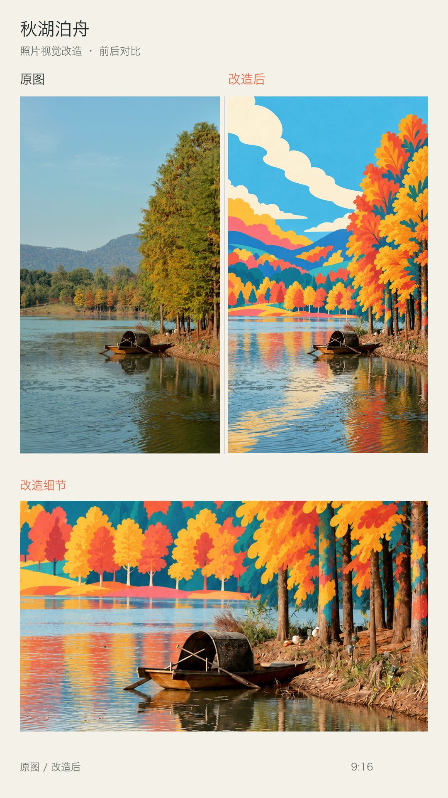

左右完整对比 + 改造后局部放大。摄影原图来源：Pexels。

## 林桥光带

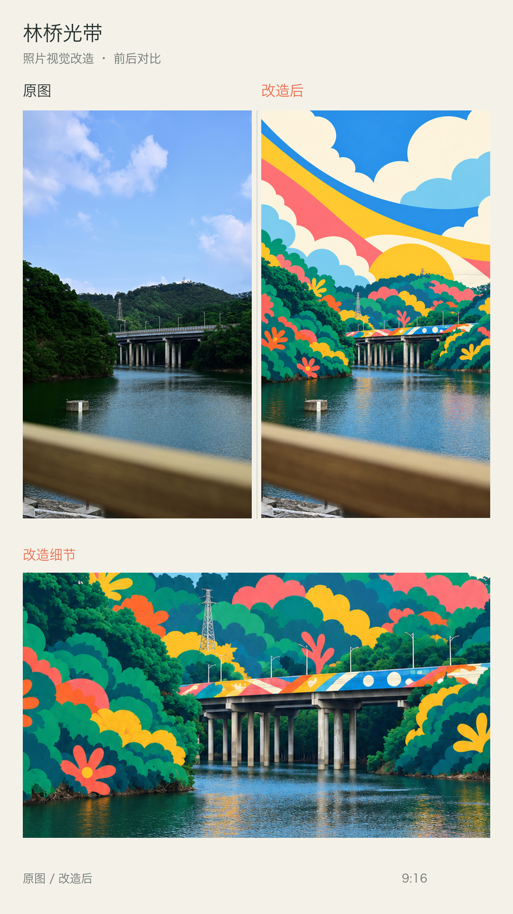

左右完整对比 + 改造后局部放大。摄影原图来源：Pexels。

## 山风帆影

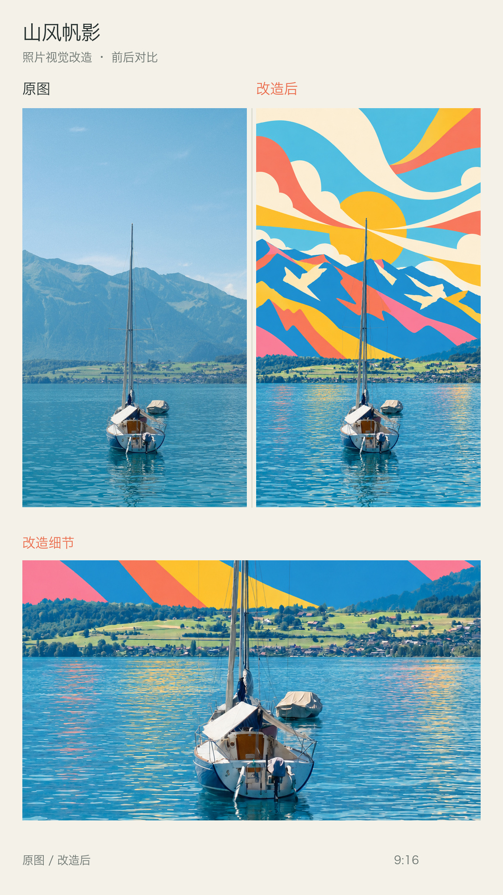

左右完整对比 + 改造后局部放大。摄影原图来源：Pexels。

## 森林巴士 · 光叶隧道

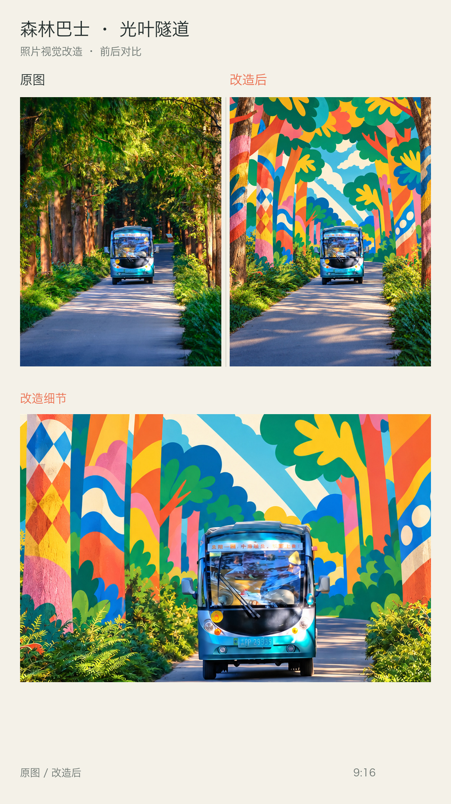

左右完整对比 + 改造后局部放大。摄影原图来源：Pexels。

## 胡同牵手 · 岁月花墙

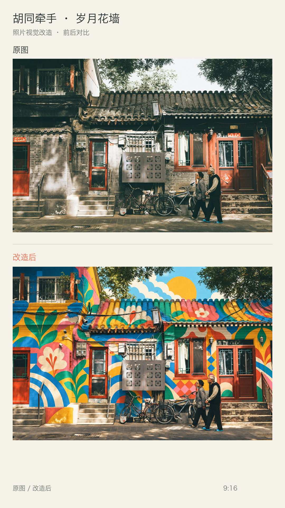

上下完整对比。摄影原图来源：Pexels。

## 莲云塔影

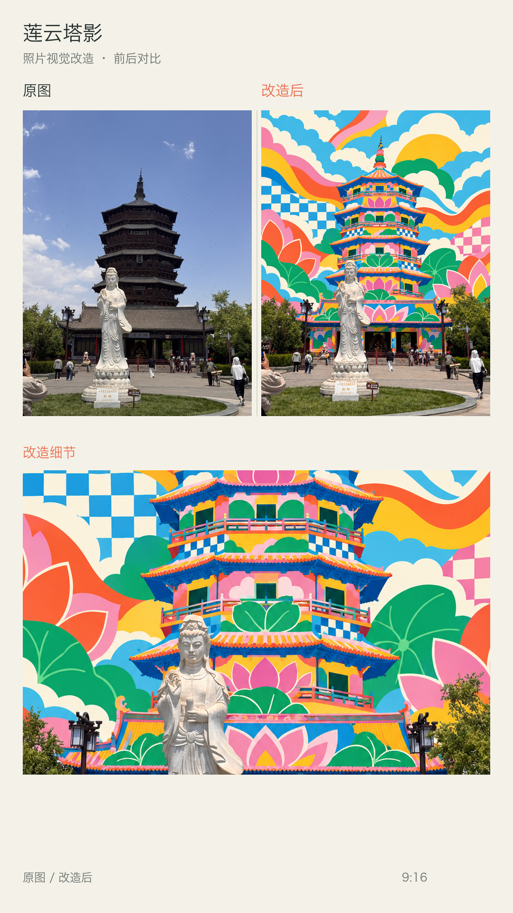

左右完整对比 + 改造后局部放大。摄影原图来源：Pexels。

## 工业能量场

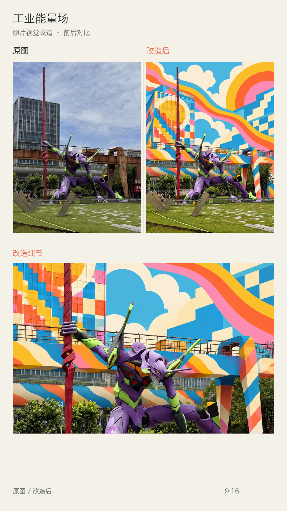

左右完整对比 + 改造后局部放大。摄影原图来源：Pexels。

## 罗马阶梯 · 拱门节奏

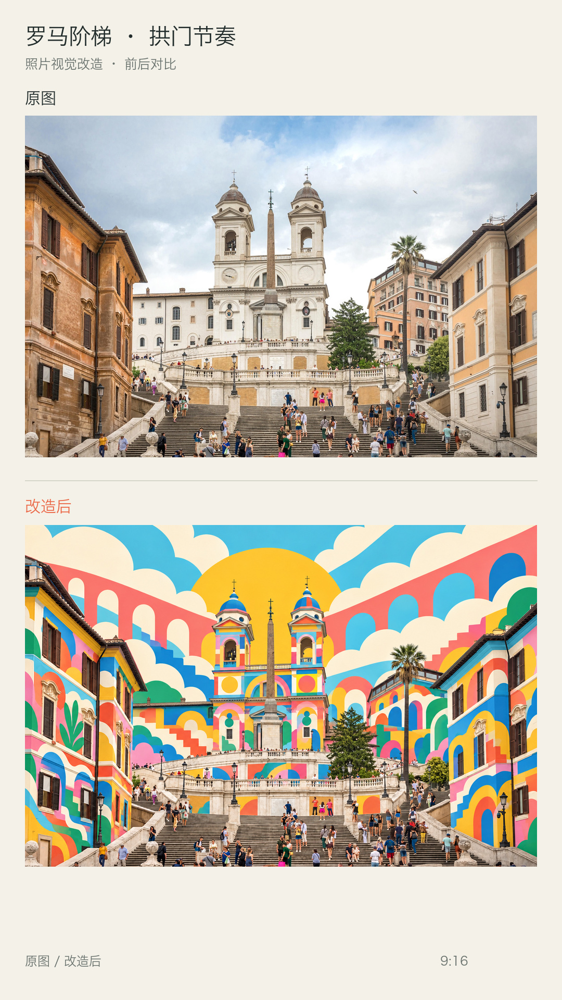

上下完整对比。摄影原图来源：Pexels。

## 泰姬陵 · 纱丽花语

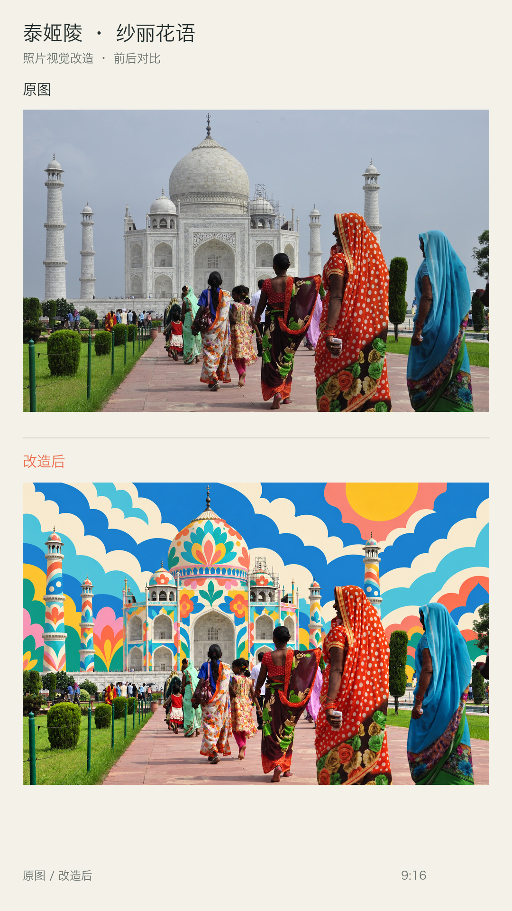

上下完整对比。摄影原图来源：Pexels。

## 山城大道 · 彩色山脊

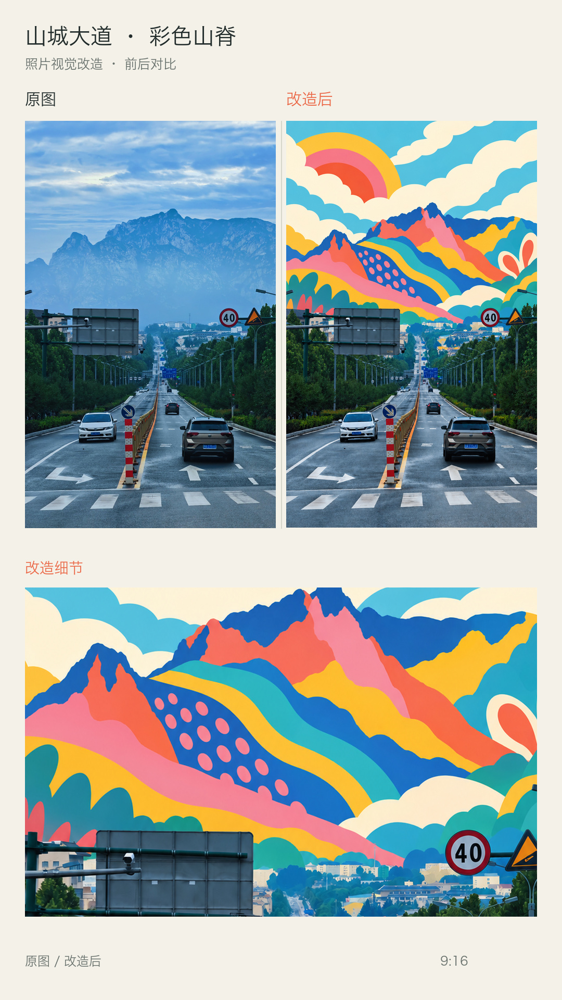

左右完整对比 + 改造后局部放大。摄影原图来源：Pexels。

## 长城 · 山海长卷

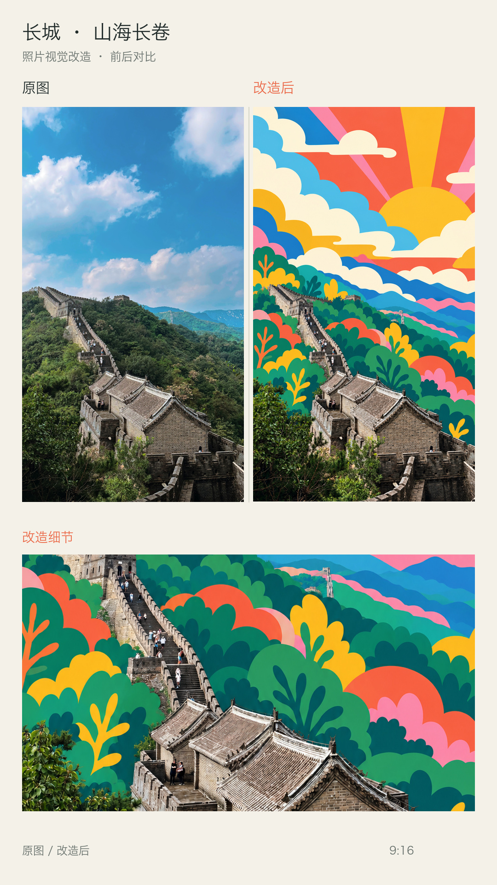

左右完整对比 + 改造后局部放大。摄影原图来源：Pexels。

## 金顶 · 云海金光

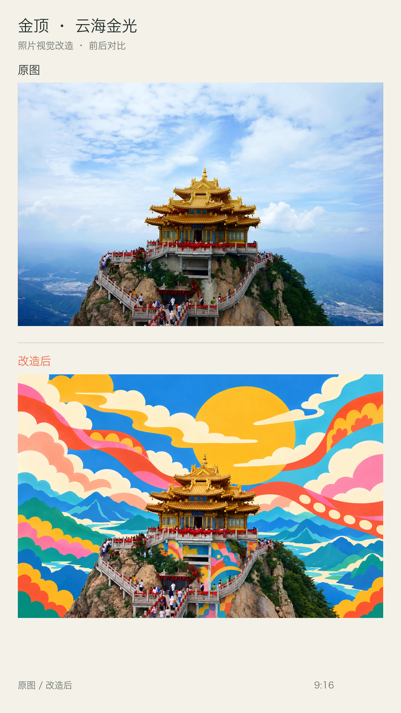

上下完整对比。摄影原图来源：Pexels。

## 海边秋千 · 浪与日光

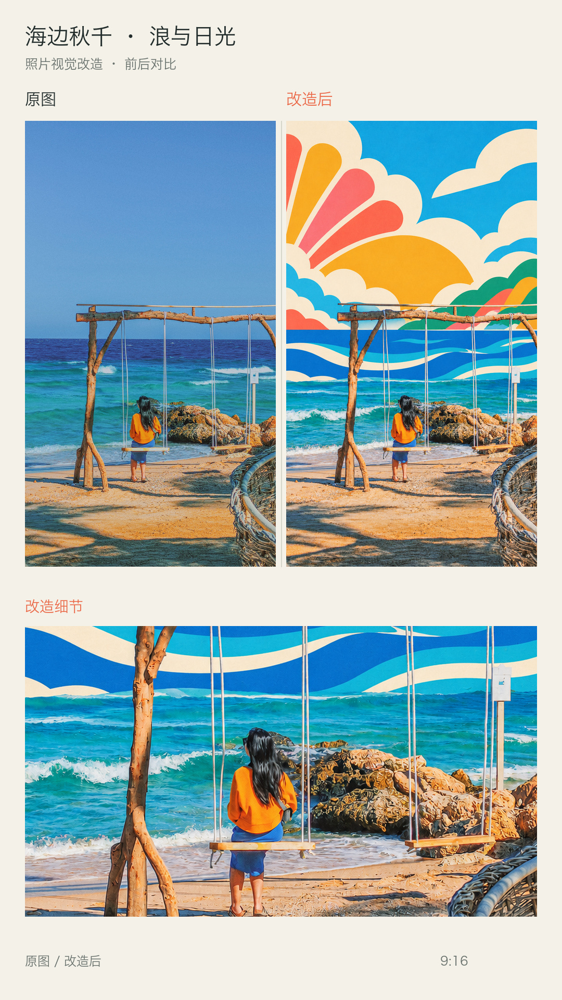

左右完整对比 + 改造后局部放大。摄影原图来源：Pexels。

## 湖畔远足 · 层山行旅

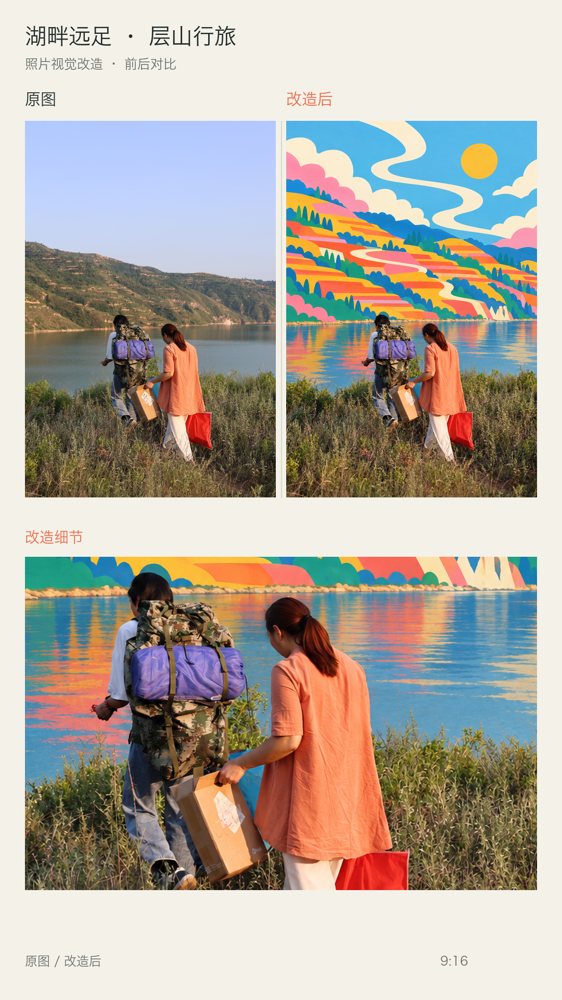

左右完整对比 + 改造后局部放大。摄影原图来源：Pexels。

## 峰顶铜像 · 层云山境

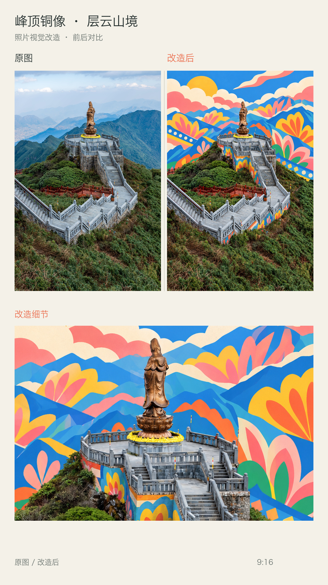

左右完整对比 + 改造后局部放大。摄影原图来源：Pexels。

## 上海天际线 · 城市织彩

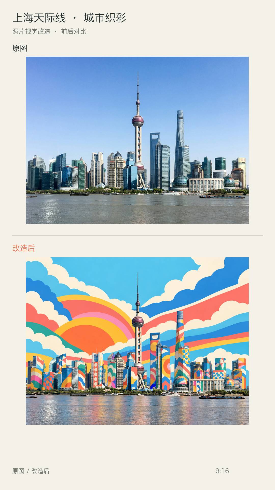

上下完整对比。摄影原图来源：Pexels。

## 故宫 · 云水宫墙

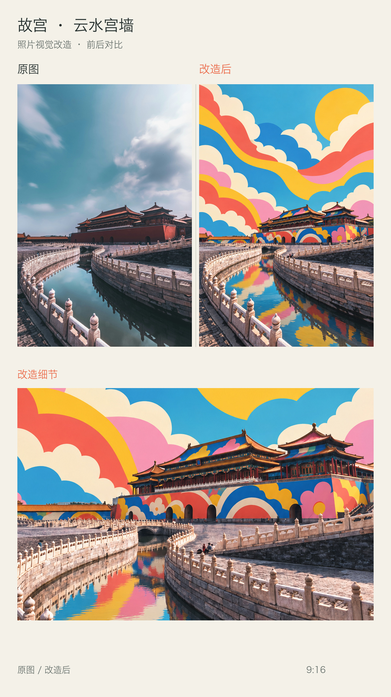

左右完整对比 + 改造后局部放大。摄影原图来源：Pexels。

